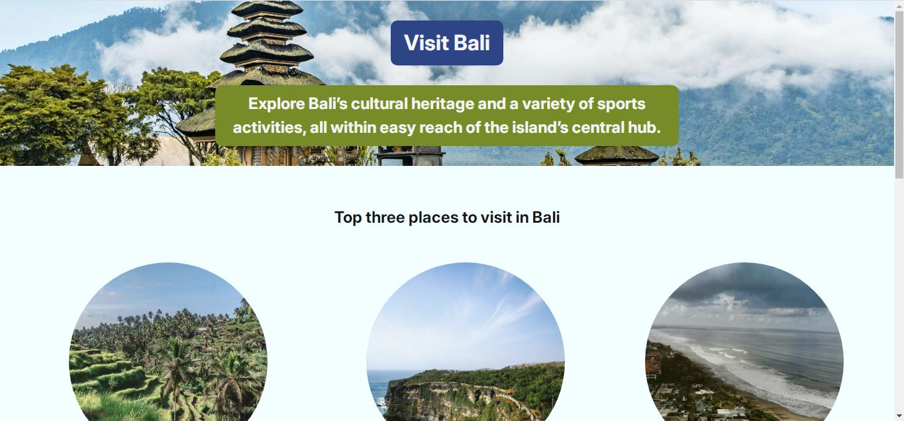

# Hometown Homepage - Bali

This project is a simple, single-page website designed to showcase the beauty and attractions of Bali, Indonesia. It serves as a personal "hometown homepage" project, built using fundamental web technologies: HTML and CSS. The page features a striking hero section, a curated list of top destinations, and a personal guide profile.

## Table of Contents

- [Project Overview](#project-overview)
- [Features](#features)
- [Technologies Used](#technologies-used)
- [Project Structure](#project-structure)
- [Getting Started](#getting-started)
- [Customization](#customization)
- [Credits](#credits)
- [License](#license)

## Project Overview

The primary goal of this project is to create an engaging and visually appealing webpage that introduces visitors to the island of Bali. The layout is clean and organized into three main sections:

1.  **Header:** A full-width hero image with a bold title and an informative subtitle.
2.  **Main Content:** A showcase of the top three places to visit, presented in a three-column grid with circular images and descriptive text.
3.  **Footer:** A profile card for a local tour guide, designed to build a personal connection with the visitor.

### Live Demo & Screenshot


Link [Live Demo](https://herveinp.github.io/bali-hometown-homepage-project/)

## Features

-   **Hero Section:** A full-width header with a captivating background image and introductory text.
-   **Top Attractions:** A visually appealing three-column grid highlighting key locations in Bali (Ubud, Uluwatu, Seminyak).
-   **Circular Place Images:** Each location is represented by a circular image for a modern aesthetic.
-   **Guide Profile:** A dedicated footer section designed as a business card for a local tour guide.
-   **Clean Typography:** Utilizes the "Inter" font from Google Fonts for excellent readability.
-   **Flexbox Layout:** The page structure is built using CSS Flexbox for flexible and centered content arrangement.

## Technologies Used

-   **HTML5:** For the structure and semantic markup of the webpage.
-   **CSS3:** For styling, layout, and visual presentation.
-   **Google Fonts:** For importing and using the 'Inter' web font.

## Project Structure

The project files are organized as follows:

```
bali-hometown-homepage/
│
├── assets/
│   └── images/
│       ├── header-image.jpg
│       ├── seminyak-photo.jpg
│       ├── tour-guide-photo.jpeg
│       ├── ubud-photo.jpg
│       └── uluwatu-photo.jpg
│
├── index.html          # The main HTML file
├── style.css           # Custom CSS styles
└── reset.css           # A CSS file to reset browser default styles
```

## Getting Started

To get a local copy up and running, follow these simple steps.

### Prerequisites

-   A modern web browser (e.g., Google Chrome, Mozilla Firefox, Safari).

### Installation

1.  Clone the repository to your local machine:
    ```sh
    git clone https://github.com/herveinp/bali-hometown-homepage-project.git
    ```
2.  Navigate to the project directory:
    ```sh
    cd bali-hometown-homepage-project
    ```
3.  Open the `index.html` file in your preferred web browser.

## Customization

You can easily customize this template for your own hometown or another location.

-   **Content:** All text can be modified directly within the `index.html` file.
-   **Images:** Replace the images in the `assets/images/` directory with your own. Ensure the file paths in `index.html` and `style.css` are updated accordingly.
-   **Styling:** Colors, fonts, spacing, and other visual properties can be adjusted in the `style.css` file.

## Credits

This project utilizes several high-quality, royalty-free assets. Proper attribution is given below.

### Photography

-   Header Image by [Guillaume Marques](https://unsplash.com/@marquesguillaume) on [Unsplash](https://unsplash.com/).
-   Ubud Photo by [Johnny Africa](https://unsplash.com/@johnnyafrica) on [Unsplash](https://unsplash.com/).
-   Uluwatu Photo by [bckfwd](https://unsplash.com/@bckfwd) on [Unsplash](https://unsplash.com/).
-   Seminyak Photo by [Afif Ramdhasuma](https://unsplash.com/@afiframdhasuma) on [Unsplash](https://unsplash.com/).

### AI-Generated Image

-   The tour guide's profile picture is an AI-generated image and does not represent a real person.

## License

Distributed under the MIT License. See [LICENSE](LICENSE) for more information.
